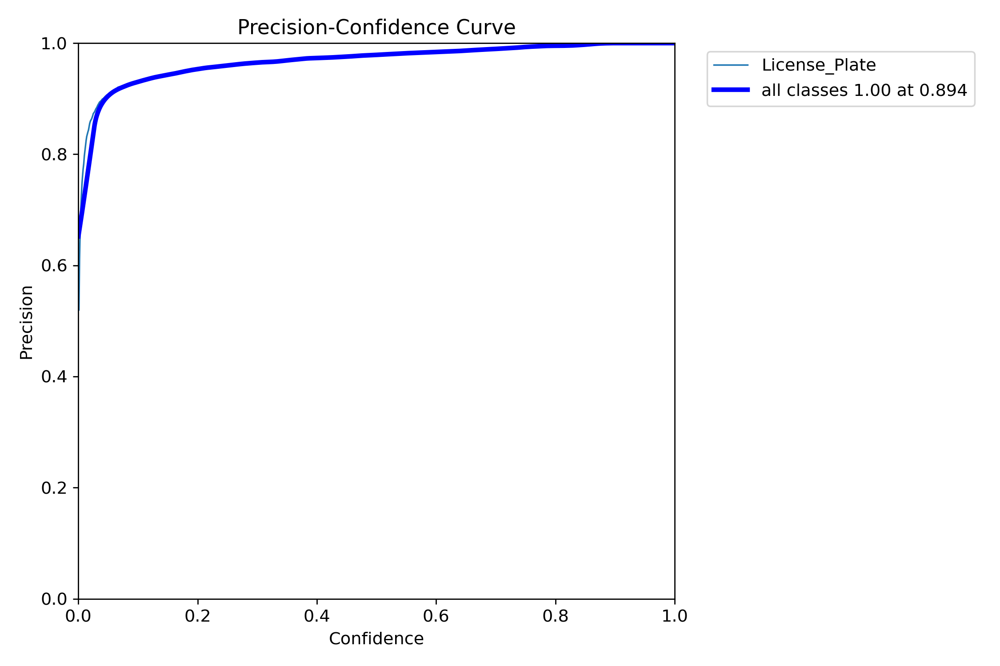

# Indonesian License Plate Recognition
> Uses "You Only Look Once" computer vision model to detect and read Indonesian license plates 

## Table of Contents
- [Indonesian License Plate Recognition](#indonesian-license-plate-recognition)
  - [Table of Contents](#table-of-contents)
  - [About](#about)
  - [Requirements](#requirements)
  - [Performance](#performance)
  - [Improvements](#improvements)

## About
A computer vision project that mainly uses a You Only Look Once (YOLO) model to detect Indonesian license plates and read its contents. This project is a part of a larger project called Automated Vehicle Register Verification System which provides a centralized system for government or law enforcement body to automatically verify a vehicle legal status on the road by cross checking its current conditions to its legally registered data. The system would use 3 computer vision models to detect:
1. License Plate
2. Color
3. Vehicle Type (Sedan, SUV, MPV, etc.)

A proof of concept demo was created with limited functionality (only license plate recognition)

## Requirements
* requirements.txt
* Python 3.11.4
* YOLOv8x
* EasyOCR
* Training Dataset: https://universe.roboflow.com/roboflow-universe-projects/license-plate-recognition-rxg4e
* Validation Video: https://www.youtube.com/watch?v=gmDBzijaIAA

## Performance
| Detect License Plates in Scene | Isolate Vehicle | Isolate License Plate in Vehicle | Process License Plate for OCR | Recognized License Plate |
|:---:|:---:|:----:|:---:|:---:|
||||| B 1395

Performance Metrics
|||
|:---:|:---:|
|||

## Improvements
* Better license plate pre-processing for OCR
* Train the license plate OCR on Indonesian license plate font 
